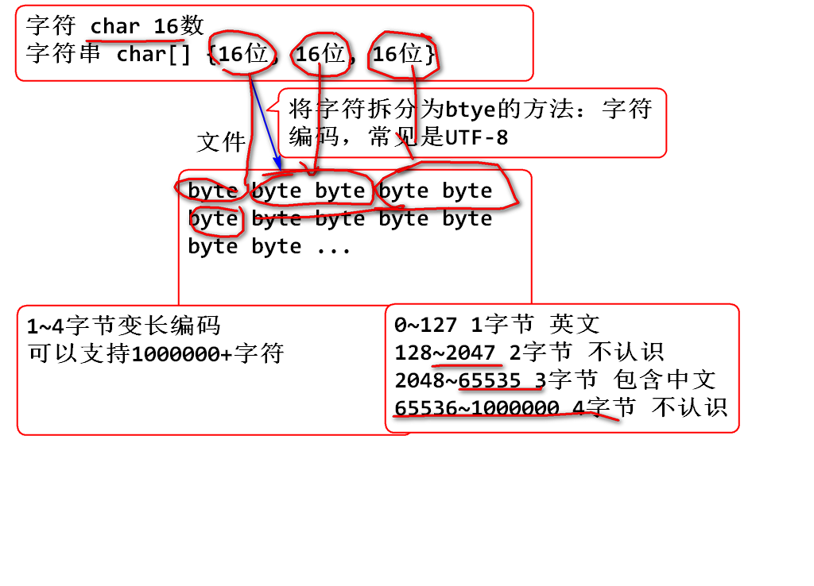

# 2进制

逢2进1的计数规则。

小数转二进制计算：
对小数点后的数乘以2，有一个结果吧，取结果的整数部分(不是1就是0喽)，然后在用小数部分在乘以2，再取结果的整数部分......依次类推，直到小数部分为0或者位数已经够了就ok了。然后把取的整数部分按先后次序排序就ok了，就构成了二进制小数部分的序列

# 16进制

16进制是2进制的简写形式，从最低位开始每4位2进制可以缩写为1位16进制
java中0x前缀告诉编译器我要写16进制了
输出2进制时候会把开头的连续的0省略(如果是0的二进制那就输出一个0),所以要从低八位开始算
专业程序员中16进制就是2进制,16只是简写,用到写2进制的时候我们都写16进制

另可了解base64位编码：A～Z，a~z,0~9,+,/，=(末尾的填充字符)共64个

# 补码

计算机中用于处理有符号的一种编码，其核心想法是将固定位数的2进制分一半作为负数使用。

以4位补码为例研究补码
(java中的byte shoat是假的,均是按照int计算，所以不要按byte算，其实java中最小的数据类型就是int)

补码的互补对称现象：
-n = ~n+1,(最小值除外)取反加一  ~ :取反,1变0,0变1(最小值取反+1就溢出了,依然是最小值)
即负数的二进制计算，先去其负号计算其正数的二进制()后取反，后加1（二进制加1），正数的二进制计算用短除法除以2

# 2进制计算

- 与 &
- 或 |
- 反 ~
- 移位 >>> >> << 

## 与 &

语法(逻辑乘法)： 

	0 & 0 -> 0
	0 & 1 -> 0
	1 & 0 -> 0
	1 & 1 -> 1

> 有0得0

将两个2进制数上下对齐，按位计算“&”

举个栗子：

	n   = 01001111 10111111 01000001 01111010
	m   = 00000000 00000000 00000000 11111111
	k=n&m 00000000 00000000 00000000 01111010

代码：

	int n = 0x4fbf417a;
	int m = 0xff;
	int k = n&m;
	System.out.println(Integer.toBinaryString(n));
	System.out.println(Integer.toBinaryString(m));
	System.out.println(Integer.toBinaryString(k));

> 如上计算称为：掩码（Mask面具）计算，其中m是掩码（Mask）是一个“8位掩码”

掩码计算常见用途：

1. 将一个整数进行拆分，截取部分内容
2. 对2整次幂取余计算可以优化为掩码计算

	00000000 00000000 00000000 00101001   //41 % 8 = 1
	00000000 00000000 00000000 00000111
	&&----------------------------------
	00000000 00000000 00000000 00000001   //1

	00000000 00000000 00000000 00101010   //42 % 8 = 2
	00000000 00000000 00000000 00000111
	&&----------------------------------
	00000000 00000000 00000000 00000010   //2

	00000000 00000000 00000000 00101101   //45 % 8 = 5
	00000000 00000000 00000000 00000111
	&&----------------------------------
	00000000 00000000 00000000 00000101   //5

经典面试题目：
	优化 n % 8  为 （   ？   ） 答案 n & 7     7的二进制为00000111取余8则把8以下的数漏出来，因为8以上的均为8的整数倍
	优化 n % 16 为 （   ？   ） 答案 n & 0xf   f为十进制的15，取余16则把16以下的数漏出来，因为16以上的均为16的整数倍
（二进制运算比加减乘除取余等效率高）
测试案例：

	for(int n=0; n<50; n++){
		System.out.print(n & 7)
		System.out.print(":")
		System.out.println(n % 8)
	}

## 右移位计算 >>>

将整数2进制整体向右移动，低位自动溢出， 高位补0

举个栗子: 将一个int数据拆分为4个byte（移位和&搭配用）

	n   =  01001101 00111010 10101000 01111110
	 
	b1  =  00000000 00000000 00000000 01001101  
	b2  =  00000000 00000000 00000000 00111010
	b3  =  00000000 00000000 00000000 10101000
	b4  =  00000000 00000000 00000000 01111110

	n>>>8= 00000000 01001101 00111010 10101000 

	b1  = (n >>> 24) & 0xff
	b2  = (n >>> 16) & 0xff
	b3  = (n >>> 8)	& 0xff
	b4  = n & 0xff;

代码：

	int n = 0x7d3aa87e;
	int b1 = (n>>>24) & 0xff;
	int b2 = (n>>>16) & 0xff;
	int b3 = (n>>>8) & 0xff;
	int b4 = n & 0xff;
	System.out.println(Integer.toBinaryString(n));
	System.out.println(Integer.toBinaryString(b1));
	System.out.println(Integer.toBinaryString(b2));
	System.out.println(Integer.toBinaryString(b3));
	System.out.println(Integer.toBinaryString(b4));

## 或 和 左移位计算 <<

或计算规则（逻辑加法）：

	0 | 0 -> 0
	0 | 1 -> 1
	1 | 0 -> 1
	1 | 1 -> 1

> 有1则为1

将两个整数2进制位对齐上下进行或计算

举个栗子：

	n     = 00000000 00000000 10011011 00000000
	m     = 00000000 00000000 00000000 11011110
	k=n|m   00000000 00000000 10011011 11011110

代码：

	int n = 0x9b00;
	int m = 0xde;
	int k = n|m;
	//按照2进制输出 n m k 

将4个byte数据合并为一个int数据：
	 
	b1  =  00000000 00000000 00000000 01001101  
	b2  =  00000000 00000000 00000000 00111010
	b3  =  00000000 00000000 00000000 10101000
	b4  =  00000000 00000000 00000000 01111110

	n   =  01001101 00111010 10101000 01111110

代码：

	int b1 = 0x4d;
	int b2 = 0x3a;
	int b3 = 0xa8;
	int b4 = 0x7e;
	int n = (b1<<24)|(b2<<16)|(b3<<8)|b4;
	//按照2进制检查 b1 b2 b3 b4 n

## 移位的数学意义

数学右移位 >>

复习移动小数点计算
	
	一个整数                  324994.
	将小数点向右移动一次      3249940.  扩大10倍
	将小数点向右移动两次     32499400.  扩大100倍
	如果看做小数点不动，数字向左移动，数字每次向左移动一位，则扩大10倍

推广： 2进制时候，数字向左移动一位，数字整体扩大2倍！
（几进制左右移就扩大缩小几倍（分配律））
举个栗子：

	n =     00000000 00000000 00000000 00110010    50
	m=n<<1  0000000 00000000 00000000 001100100   100
	k=n<<2  000000 00000000 00000000 0011001000   200
	a=n<<3  00000 00000000 00000000 00110010000   400

代码：

	int n = 50;
	int m = n<<1;
	int k = n<<2;
	int a = n<<3;
	//按照10进制输出 n m k a 

经典面试题目： 乘以2的n次幂，可以优化为左移位计算

	优化 n * 8 为（    ） 答案: n<<3

数学右移位 >> 和逻辑右移位 >>> 的区别：

1. 正数时候这个两个计算结果一样，都是2进制数字整体向右移动，低位自动溢出，高位补0 
2. 负数时候不同：
	- 数学右移位 >>： 将2进制数字整体向右移动，低位自动溢出，高位补1
	- 逻辑右移位 >>>： 将2进制数字整体向右移动，低位自动溢出，高位补0

数学右移位 >> 结果接近数学结果，相当于数字除以2向小方向取整数
（向右移位有高位是0还是1的问题，向左移位没有，所以向右箭头有两种，向左箭头只需一种）

举个栗子：

	n     =  11111111 11111111 11111111 10011000   -104
	m=n>>1   111111111 11111111 11111111 1001100    -52
	k=n>>2   1111111111 11111111 11111111 100110    -26
	h=n>>3   11111111111 11111111 11111111 10011    -13
	g=n>>4   111111111111 11111111 11111111 1001     -7
	
	n     =  11111111 11111111 11111111 10011000   -104
	a=n>>>1  011111111 11111111 11111111 1001100   接近最大值

> 逻辑右移位用于数字的拆分等场合。

代码：

	int n = -104;
	int m = n>>1;
	int k = n>>2;
	int h = n>>3;
	int g = n>>4;

# UTF-8 

UTF-8：是Unicode字符序列化为byte数据时候的编码

###我的：
1. 查阅：https://blog.csdn.net/u010737354/article/details/52456570
unicode虽然统一了全世界字符的二进制编码，但没有规定如何存储啊；
utf-8就是Unicode最重要的实现方式之一；
常规来看，中文汉字在utf-8中到底占几个字节，一般是3个字节，最常见的编码方式是1110xxxx      10xxxxxx 10xxxxxx。

2. 对图utf8.png的理解：

char确实是两个字节，最多表示65535，但是uft8将表示中文的char拆分为byte的时候，需要用3字节表示中文。utf8是1～4字节可变长编码，超过65535的数char装不下，要用其他的类型表示。其实65535已经包含了地球的语言，超过65535的刘苍松说连麻将图都有

3. 查阅：https://www.cnblogs.com/web21/p/6092414.html
UTF规定：如果一个符号只占一个字节，那么这个8位字节的第一位就为0。如果为两个字节，那么规定第一个字节的前两位都为1，然后第一个字节的第三位为0，第二个字节的前两位为10，然后如果是三个字节的话，那么第一个字节的前三位为111，第四位为0，剩余的两个字节的前两位都为10。
  题外话：　　
然，中国的汉字多达10多万，常用的汉字3500左右[08年统计]，如果用3个字节来表示，一共只有2^16(65535)种可能，不足以表示10多万的汉字。所以中日韩的超大字符集是采用的4个字节来表示的，多达6万多个。但是平时使用超大字符集的概率0.01%都不到。所以我们一般认为日常的中文在UTF-8中占三个字节 即可！

