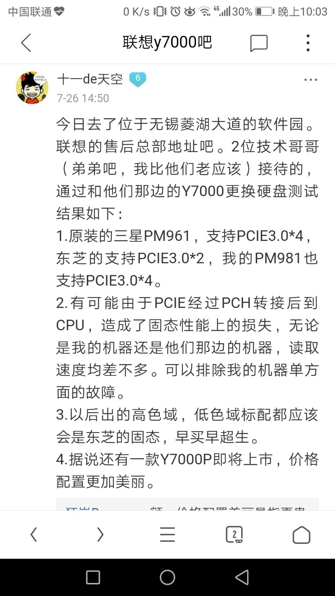

##验机：
 - 外观 封条各个序列号；在线屏幕检测工具；鲁大师 ；ssd 测速 写入  对齐 ；各键位 灯光 特别功能；各个接口

##虚拟内存：
 - 有些软件程序（ps、3Dmark等）必须使用虚拟内存才能运行，所以不推荐设置为0（没有必须用虚拟内存的软件可以设置为0）。
 - 虚拟内存文件=分页文件  清理办法百度
 - 传统的虚拟内存设置为物理内存的1.5-2倍3倍，一般4G以下的设置虚拟内存，但现在物理内存已经很大了已经没必要设置（那么大的）虚拟内存了， - 虚拟内存的大小让系统托管（自动分配）最好，16G的内存不需要手工设置了

##ssd：
 - 可拆卸的NAND（闪存颗粒）储存装置，u盘是闪存的一种也叫闪盘；
 - ssd读写有时可能和windows的写入缓存技术有关系

##CDN&镜像站点
###CDN(Content Delivery Network)内容分发网络
 - 其基本思路是尽可能避开互联网上有可能影响数据传输速度和稳定性的瓶颈和环节，使内容传输的更快、更稳定。
 - 通过在网络各处放置节点服务器所构成的在现有的互联网基础之上的一层智能虚拟网络，CDN系统能够实时地根据网络流量和各节点的连接、负载状况以及到用户的距离和响应时间等综合信息将用户的请求重新导向离用户最近的服务节点上。
 - 其目的是使用户可就近取得所需内容，解决 Internet网络拥挤的状况，提高用户访问网站的响应速度。
###镜像站点
 - 和主站服务器一样的服务器
###cdn和镜像站点的区别
		参考：https://blog.csdn.net/joeyon1985/article/details/44592343
 - 例如阿里云CDN的作用是做文件加速，实现的方式是：由用户触发，CDN节点被动回源获取内容，缓存这份资源的同时返回该资源给用户，是一个被动拉取数据的过程。后续对该资源的访问，CDN返回缓存资源给用户端。
 - 镜像站点是将数据全部都放在本地，用户请求的时候，就直接push给用户，不需要再额外回源取数据。
###关于a比b快的原因
	a=eclipse网站下载“在线安装工具”后在工具里安装自己需要的eclipse
	b=在网站里直接下载自己需要的eclipse
 - a比b快的原因是，网站里的链接只能链接一个（当然是主站服务器），而在线安装工具是一个程序可以检索最快CDN或者镜像服务器来下载
``	参考

##Dos和cmd
 - dos也是一种操作系统，是在windows出现以前用的，后来windows出来后基本没人用了，但是当windows崩溃的时候，还是要的dos方式解决，它是一种纯命令方式，cmd其实就是在windows状态下进入dos方式。

##pm981的缓存：
 - 固态测速读的是缓存
 - 512G的Pm981有24G的slc缓存，256版的13G。所以读写测速比sm961快。但是其本身是TLC闪存，所以24G缓存一旦写满就变慢了。Sm961本身是MLC闪存所以看着比pm981慢		
		这样sm961可能没有缓存，如果有的话那只能是更快的slc，因为比mlc快的就是slc了
 - Pm981比sm961好像晚两年，所以买新不买旧还是有道理的。新的技术更好：24G的SLC缓存够应付突发性高速写入了。SLC缓存写满后，停止写入的话，大概过1~2分钟后SLC缓存会回写到TLC，并清空。
		参考https://tieba.baidu.com/p/5768773920?pn=0&
###参考http://tieba.baidu.com/p/5689479566
 - 带DRAM并且存在SLC Cache的TLC可以这么理解为三级缓存：
	【1】512M的那个是DRAM缓存，速度不是SLC Cache能比的参见内存速度，但是只对数据量不超过这个数字的零碎文件起作用，一般用于提升短时间内的4K IOPS。
	【2】SLC Cache是通过主控对数据编程算法的调整通过TLC NAND模拟而来，这个速度比DRAM要慢得多，通常在DRAM Cache用光之后会使用这部分容量进行加速，也即是你说的那个13g。
	【3】当DRAM和SLC Cache都被耗尽的情况下，数据的读写速度尤其是写入速度会跌至直写TLC的速度，这个速度通常为300~600MB/s左右，也就是最后一级的速度。

##我的电脑pm981固态问题终解
		https://tieba.baidu.com/p/5806706193?pn=0&

##linux格式文档在windows下缺少换行的解决方法
 - 原理：在Linux系统下， '\n'就是一个换行符，而在windows下，它是由回车换行组成，表示为 \r\n 
 -解决方法：使用Notepad++进行文档格式转换
	Notepad++打开文档-->编辑-->文档格式转换-->转换为Windows格式 

##内存
 - 一般小主板两个内存条槽，大主板4个内存槽
###双通道
 - 组建双通道：两个同型号大小的内存条
 - 好处：两个8g内存各发挥百分之60的作用，比一个16g内存发挥百分之100的作用大 

##cpu缓存
 - 缓存也叫高速缓存，用来存cpu运算的中间结果。一般几十k。
		比如7＋9＋1，需要先得出7＋9＝16，这个16就是中间结果

##为什么x86是32位
 - x86是一种cpu架构，因为intel的8086，286，386～586而得名，X64全称叫x86_64

##bin目录/lib目录：
		目录下放什么文件仅仅是一些约定而已, 为了方便管理, 也并不是说必须要这么做
 - bin目录：bin=binary，一般用来存放EXE(可执行文件),DLL(dll动态链接库文件)等文件，应用软件安装后一般都含这个目录
 - lib目录：lib=library，都是伴随dll文件的动态lib文件。
		staticlib文件夹里面放的才是真正的静态lib文件，和dll文件是独立的；
		需要整理的时候再看这个吧：https://blog.csdn.net/m0_37876745/article/details/78323848

##可执行文件：
 - 可执行文件：简单的说你双击能运行的，可执行文件是指计算机的操作系统能够解释并执行的二进制代码文件。
 - 最初的可执行文件包括代码段、数据段、堆栈段和扩展段等。代码段存放了计算机的执行指令，即CPU要进行的操作指令，数据段存放了CPU要用到的数据，堆栈段则存放了与寄存器有关的信息等等。现在你觉得许多文件都能够被计算机执行，是因为操作系统已经做得比较人性化，例如你双击一个文本文件（*.txt），该文件即被打开，这是因为操作系统调用了Notepad.exe这个可执行文件打开了这个文本文件。实际上，被执行的文件是Notepad.exe，而文本文件只是Notepad.exe的执行目标。 

##电脑32位和64位的区别
 - 64位操作系统的设计初衷是为了满足机械设计和分析、三维动画、视频编辑和创作，以及科学计算和高性能计算应用程序等领域中需要大量内存和浮点性能的客户需求。需要64位处理器支持
		参考https://zhidao.baidu.com/question/534880209.html        http://www.windows7en.com/Win7News/18485.html

##32位只能发挥4G内存的效用
		//https://blog.csdn.net/jack271/article/details/78875412
		备用//https://www.cnblogs.com/nvd11/archive/2013/04/02/2996784.html
 - 和内存地址有关，地址最多读到2^32个=4G

##mac和windouws的文件系统格式问题||FTA32&NTFS：
 - FTA32：FAT是文件配置表（英语：File Allocation Table，首字母缩略字：FAT），是一种由微软发明并拥有部分专利的文件系统，供MS-DOS使用，也是所有非NT核心的微软窗口使用的文件系统。FAT文件系统考虑当时电脑性能有限，所以未被复杂化，因此几乎所有个人电脑的操作系统都支持。这特性使它成为理想的软盘和存储卡文件系统，也适合用作不同操作系统中的数据交流。现在，一般所讲的FAT专指FAT32。
		TAF32支持的单一文件大小不能超过4G
 - mac支持FAT32以及他自己的文件格式
 - windouws支持FAT32、NTFS(也是基于windouws系统的)等自己的文件格式
		为什么要设置自己系统对应的，当然是不能研制出来后让竞争对手用

##关于exFAT格式：
 - exFAT只是一个折中的方案，特别适合于闪存的文件系统。
 - 现在超过4GB的U盘格式化时默认是NTFS分区，但是这种格式是很伤U盘的。因为NTFS分区是采用“日志式”的文件系统，需要记录详细的读写操作，伤闪盘芯片

##小项：
1. C盘：Program Files是64位软件安装目录。    Program Files（x86）是32位软件安装目录。

